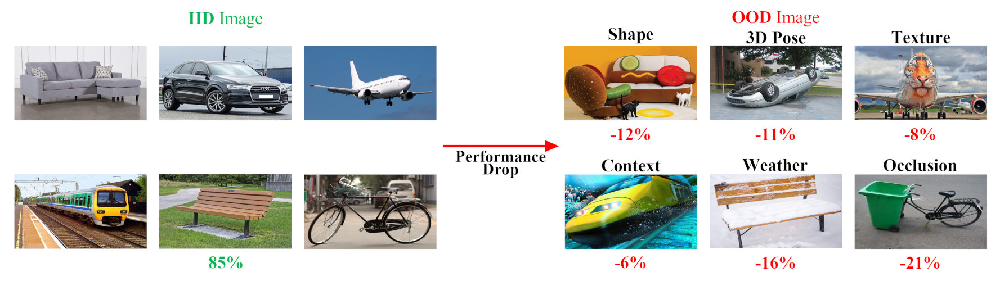
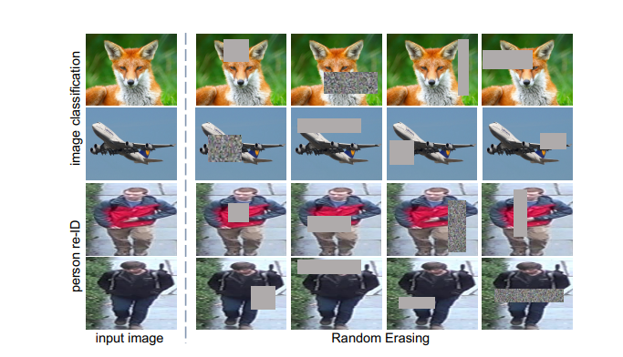
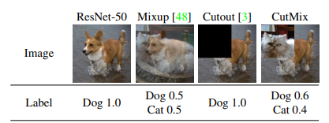
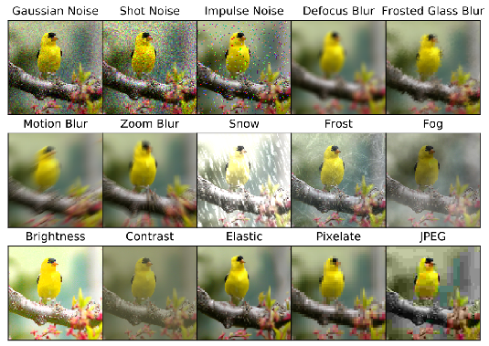

# ECCV2022-OOD-CV-Challenge-Classification-Track-Solution
This repository is an open source sharing of the ECCV2022-OOD-CV-Challenge-Classification-Track solution

## 0. Introduction

Deep learning models are usually developed and tested under the implicit assumption that the training and test data are drawn independently and identically distributed (**IID**) from the same distribution. Overlooking out-of-distribution (**OOD**) images can result in poor performance in unseen or adverse viewing conditions, which is common in real-world scenarios. This competition requires prediction of the OOD dataset - ROBIN, while only using ImageNet-1k and PASCAL VOC datasets to train the model. The competition also established an accuracy threshold for the model to predict i.i.d data



## 1. Solution

### 1.1 Data analysis

In the rules of the competition, the ROBIN data set, a data set containing 10 categories of objects such as aircraft, buses, bikes, trains, etc., is explained. In the test set, it can be divided into six directions of distributed external interference, including 3D pose, shape, texture, weather, etc. 

Due to the requirements of the rules of the game, the data sets used in the pre-training can only be the ROBIN training set and ImageNet-1K, which have almost no OOD data. Therefore, we consider using data augmentation to convert iid data into ood data.

### 1.2 Model selection

By calling the timm function library, we quickly built several SOTA classification models, including ResNet, ConvNeXt, EfficientNet, Vision Transfomer, Swin Transfomer, DeiT, etc. The pre-trained model is used to predict directly on the test set. The test results are as follows.

|   Model Name    | IID-TOP-1 | OOD-TOP-1(Mean) |
| :-------------: | :-------: | :-------------: |
|    ResNet_50    |  85.232   |     81.365      |
| EfficientNet_b3 |     -     |     81.461      |
|  ConvNeXt_base  |  86.339   |     87.561      |
|    ViT_base     |     -     |     81.139      |
|   SwinT_base    |  85.721   |     84.387      |
|   DeiT-large    |  90.024   |     90.301      |

In order to pursue better prediction results, we consider using CNN + Transfomer ensemble learning, and select DeiT-large and ConvNeXt with the best OOD data test results as the backbone of the model.

### 1.3 data processing

#### 1. Classical data augmentation & AutoAugment

Classical data augmentation and automatic data augmentation are essentially to obtain additional data by rotating, scaling, translating, flipping, cropping, etc. After the experiment, we found that this data enhancement method has little effect on improving the recognition of ood data. On the contrary, it will improve the prediction accuracy of the model 's iid data, resulting in iid accuracy exceeding the limit. The reason is that traditional data augmentation can only produce additional iid data, but it is not helpful for ood data generation.

#### 2. Random-Erasing

The Random-Erasing data enhancement method is to improve the ability of the model to identify partially occluded objects in target detection and image recognition. Since the test set contains some data outside the ' Occlusion ' distribution, this method can be used to enhance the data and improve the ability of the model to recognize the occluded object.



#### 3. CutMix & Mixup



#### 4. Corruption Method

By analyzing the out-of-distribution data of the test set, ' Weather ' is better simulated. Through research, a destructive data enhancement method is found to improve the robustness of the model, which can simulate weather conditions such as rain, snow and fog.



 

|              Augmentation               | IID Top-1 | OOD Top-1(Mean) |
| :-------------------------------------: | :-------: | :-------------: |
|               AutoAugment               |  +0.14%   |     -0.19%      |
|             Random Erasing              |  -0.18%   |     +0.34%      |
|                  Mixup                  |  -0.13%   |     +0.51%      |
|                 CutMix                  |  -0.13%   |     +0.51%      |
| Corruption Method (Weather and Digital) |  +0.35%   |     +0.13%      |

#### 5. Style transfer 

Analyze the out-of-distribution data of the test set, which contains ' Context ' out-of-distribution interference, and consider that style transfer can be used to generate. However, because the use of data sets is limited, we cannot use general style transfer based on deep learning. After further investigation, because the OOD test set contains more data with large differences between the color style and the conventional color style of the object ( for example, the aircraft under water ), it was decided to use the traditional color transfer method. 

This is a traditional image processing method that does not require data-driven, and can mix the color style information of one picture with the content information of another picture. Firstly, in order to facilitate image processing and remove the correlation between image components, the image is converted from $RGB$ color space to $ L\alpha\beta $ color space. After the color transfer in the $ L\alpha\beta $ space, the image is converted back to the $RGB$ color space image.

- Convert $RGB$ space to $LMS$ space

$$
\begin{bmatrix} L \\ M \\ S \end{bmatrix} =log\begin{Bmatrix} \begin{bmatrix} 0.5141&0.3239&0.1604 \\ 0.2651&0.6702&0.0641 \\ 0.0241&0.1228&0.8444 \end{bmatrix} \begin{bmatrix} R \\ G \\ B \end{bmatrix} \end{Bmatrix}
$$

-  Convert $LMS$ space to $L\alpha\beta$ space.

$$
\begin{bmatrix} L \\ \alpha \\ \beta \end{bmatrix} = \begin{bmatrix} \frac{1}{\sqrt{3}} & 0 & 0  \\  0 & \frac{1}{\sqrt{6}} & 0  \\  0 & 0 & \frac{1}{\sqrt{2}}  \end{bmatrix} \begin{bmatrix} 1 & 1 & 1 \\ 1 & 1 & -2 \\ 1 & -1 & 0 \end{bmatrix}  \begin{bmatrix} L \\ M \\ S \end{bmatrix}
$$

### 1.4 Semi-supervised learning : Pseudo-Label method

In order to get a better prediction effect of the test set, we consider combining the labeled data of the training set and the unlabeled data of the test set for semi-supervised learning. First, transfer learning is performed on the model using labeled data. Then use the model after the first round of training to predict the unlabeled data, set the prediction confidence threshold, select the prediction data higher than the threshold, and use it as the pseudo-label of the data. Then these pseudo-label data are mixed with labeled data for the next round of training. 

This iteration is repeated until the model prediction accuracy decreases.

## 2. Prerequisites

### 2.1 Hardware & Software

- Ubuntu 18.04.3 LTS

- GPU: 2 * NVIDIA 3090, Memory: 24 G
- CPU: AMD EPYC 7543 32-Core Processor
- Python == 3.8
- torch == 1.8.1+cu111
- trochvision == 0.9.1+cu111

### 2.2 Data Preparation

The project uses the ROBIN dataset provided by the competitor, which can be downloaded from [here](https://bzhao.me/OOD-CV/).

Please make sure the dataset is placed as shown below, where `pseudo-label` represents the pseudo-label data generated iteratively.

```
├── dataset/
│   ├── ROBINv1.1-cls-pose
│   ├── ROBINv1.1-det
│   ├── pseudo-label
│   ├── phase2-cls
│   ├── phase2-det
```

### 2.3 Model Preparation

Get pre-trained models from [Timm package](https://github.com/huggingface/pytorch-image-models#licenses)

## 3. Train the model

Divided into three stages of training, the code files used are `src/train.sh`, `src/test.sh` and `src/ensemble.ipynb`

`src/train.sh` : For model training

`src/test.sh` : For model prediction

`src/ensemble.ipynb` : For hybrid model prediction results, ensemble learning

### 1. 1st stage

1. Run `train.py` to train 2 models ( ConvNeXt & DeiT )  

```shell
python -m torch.distributed.launch \
		--master_port 32620 \
		--nproc_per_node=2 train.py \
		-c configs/deit_large_384.yaml \
		--output ../../output/deit/large_384/20220911

python -m torch.distributed.launch \
		--master_port 32627 \
		--nproc_per_node=2 train.py \
		-c configs/convnext_large.yaml \
		--output ../../output/convnext/large_224/20220910 \
		--model-ema
```

2. Run `test.py`  to predict the test data

```shell
python test.py --model deit3_large_patch16_384 \
              --num-gpu 2 \
              --img-size 384 \
              --num-classes 10 \
              --batch-size 200 \
              --checkpoint ../../output/deit/large_384/20220911/deit3_large_0913/checkpoint-0911.pth.tar \
              --output_path ../predict-result/deit_large_384/ \
              --scoreoutput_path ../predict-result/deit_large_384/

python test.py --model convnext_large \
              --num-gpu 2 \
              --img-size 224 \
              --num-classes 10 \
              --batch-size 200 \
              --checkpoint ../../output/convnext/large_224/20220902/convnext_large_0904/checkpoint-0902.pth.tar \
              --output_path ../predict-result/convnext_large_224/ \
              --scoreoutput_path ../predict-result/convnext_large_224/
```

3. Run `ensemble.ipynb`  to ensemble them to output 1st round Pseudo-labeling

```shell
run src/ensemble.ipynb
```

### 2. 2nd stage

1. Run `train_round1.py` to train 2 models ( ConvNeXt & DeiT )  using 1st round Pseudo-labeling

```shell
python -m torch.distributed.launch \
		--master_port 32620 \
		--nproc_per_node=2 train_round1.py \
		-c configs/deit_large_384.yaml \
		--output ../../output/deit/large_384/20220919
 
python -m torch.distributed.launch \
		--master_port 32627 \
		--nproc_per_node=2 train_round1.py \
		-c configs/convnext_large.yaml \
		--output ../../output/convnext/large_224/20220919 \
		--model-ema
```

2. Run `test.py`  to predict the test data

```shell
python test.py --model deit3_large_patch16_384 \
              --num-gpu 2 \
              --img-size 384 \
              --num-classes 10 \
              --batch-size 200 \
              --checkpoint ../../output/deit/large_384/20220919/deit3_large_0928/checkpoint-0920.pth.tar \
              --output_path ../predict-result/deit_large_384_Add_5_Pseduo/ \
              --scoreoutput_path ../predict-result/deit_large_384_Add_5_Pseduo/

python test.py --model convnext_large \
              --num-gpu 2 \
              --img-size 224 \
              --num-classes 10 \
              --batch-size 200 \
              --checkpoint ../../output/convnext/large_224/20220925/convnext_large-224_0925/checkpoint-0925.pth.tar \
              --output_path ../predict-result/convnext_large_Add_5_Pseduo/ \
              --scoreoutput_path ../predict-result/convnext_large_Add_5_Pseduo/
```

3. Run `ensemble.ipynb`  to ensemble them to output 2nd round Pseudo-labeling

```shell
run src/ensemble.ipynb
```

### 3. 3rd stage

Run `train_round2.py` to train 2 models ( ConvNeXt & DeiT )  using 2nd round Pseudo-labeling

```shell
python -m torch.distributed.launch \
		--master_port 32620 \
		--nproc_per_node=2 train_round2.py \
		-c configs/deit_large_384.yaml \
		--output ../../output/deit/large_384/20220928
 
python -m torch.distributed.launch \
		--master_port 3262 \
		--nproc_per_node=2 train_round2.py \
		-c configs/convnext_large.yaml \
		--output ../../output/convnext/large_224/20220928 \
		--model-ema
```

## 4. Evaluation

1. Run `test.py`  to predict the test data

```shell
python test.py --model deit3_large_patch16_384 \
              --num-gpu 2 \
              --img-size 384 \
              --num-classes 10 \
              --batch-size 200 \
              --checkpoint ../../output/deit/large_384/20220930/deit3_large_0930/checkpoint-0930.pth.tar \
              --output_path ../predict-result/deit_large_384_Add_8_Pseduo/ \
              --scoreoutput_path ../predict-result/deit_large_384_Add_8_Pseduo/

python test.py --model convnext_large \
              --num-gpu 2 \
              --img-size 224 \
              --num-classes 10 \
              --batch-size 200 \
              --checkpoint ../../output/convnext/large_224/20220930/convnext_large_0930/checkpoint-0930.pth.tar \
              --output_path ../predict-result/convnext_large_Add_8_Pseduo/ \
              --scoreoutput_path ../predict-result/convnext_large_Add_8_Pseduo/
```

2. Mix the predicted results of the two models. For details, see `src /ensemble.ipynb`

```
run src/ensemble.ipynb
```

## 5. References

1. Hendrycks, D., Dietterich, T.: Benchmarking neural network robustness to common corruptions and perturbations. Proceedings of the International Conference on Learning Representations (2019)
2. Zhong Z ,Zheng L ,Kang G , et al. Random Erasing Data Augmentation[J]. Proceedings of the AAAI Conference on Artificial Intelligence,2020,34(07).
3. He M ,Liao J ,Chen D , et al. Progressive Color Transfer With Dense Semantic Correspondences[J]. ACM Transactions on Graphics (TOG),2019,38(2).
4. Zhang H, Cisse M, Dauphin Y N, et al. mixup: Beyond empirical risk minimization[J]. arXiv preprint arXiv:1710.09412, 2017.
5. Yun S, Han D, Oh S J, et al. Cutmix: Regularization strategy to train strong classifiers with localizable features[C]//Proceedings of the IEEE/CVF international conference on computer vision. 2019: 6023-6032.
6. Xu, L., Ouyang, W., Bennamoun, M., Boussaid, F., Xu, D.: Multi-class token transformer for weakly supervised semantic segmentation. In: Proceedings of the IEEE/CVF Conference on Computer Vision and Pattern Recognition. pp. 4310– 4319 (2022)

## 6. Acknowledgment

* Thanks to [timm](https://github.com/rwightman/pytorch-image-models) for Pytorch implementation.
